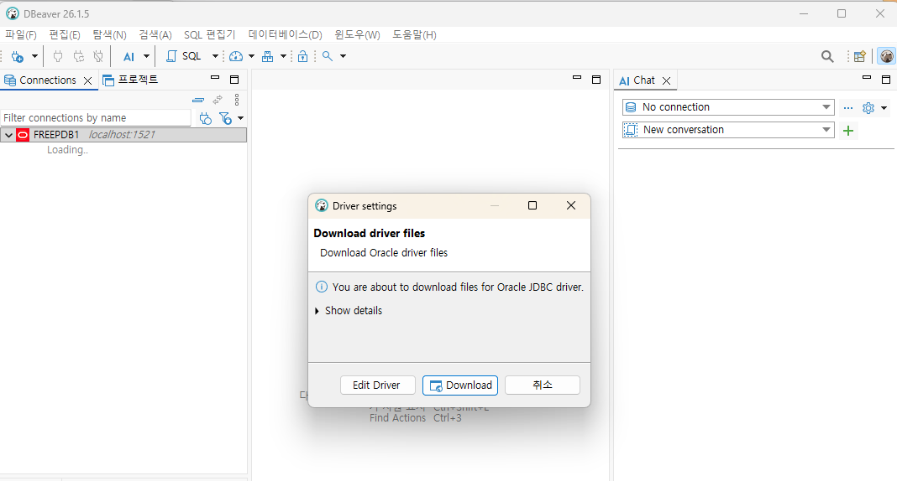

# db 클라이언트 설치 및 oracle 연결하기

# 0. dbvear 다운 로드 및 설치
https://dbeaver.io/download/

# 1. Windows에 DBeaver 설치

Windows에는 **DBeaver Community Edition**을 설치하면 된다.

설치 후:

```text
Database
→ New Database Connection
→ Oracle
```

을 선택한다.

## DBeaver 접속 설정

계정 생성을 위해 system 계정으로 연결 한다. 다음과 같이 입력한다.

| 항목                 | 값               |
| ------------------ | --------------- |
| Host               | `localhost`     |
| Port               | `1521`          |
| Database / Service | `FREEPDB1`      |
| Authentication     | Database Native |
| Username           | `system`           |
| Password           | `Oracle1234`       |

중요한 부분은 Oracle Free에서는 다음과 같이 **Service Name**으로 접속하는 것이다.



## 사용자 계정을 생성한다.
```

```


```text
localhost:1521/FREEPDB1
```

---

# 2. DBeaver에서 연결

DBeaver의 Oracle 연결 화면에서 JDBC URL은 대략 다음 형태가 된다.

```text
jdbc:oracle:thin:@//localhost:1521/FREEPDB1
```

설정:

```text
Host        : localhost
Port        : 1521
Service Name: FREEPDB1

Username    : joy
Password    : Joy1234
```

그리고:

```text
Test Connection
```

을 실행한다.

처음 연결하면 Oracle JDBC Driver 다운로드 메시지가 나올 수 있는데, DBeaver에서 다운로드하면 된다.

---

# 3. 관리자 계정도 DBeaver에 등록

SQLD 실습에서는 `joy`를 기본 계정으로 사용하는 것이 좋지만, 관리자 계정도 하나 만들어두면 편하다.

### SYSTEM 연결

```text
Host        : localhost
Port        : 1521
Service     : FREEPDB1

Username    : system
Password    : Oracle1234
```

따라서 DBeaver에 다음 두 연결을 만들어두면 된다.

```text
Oracle-SYSTEM
Oracle-JOY
```

평소 SQL 실습:

```text
Oracle-JOY
```

관리 작업:

```text
Oracle-SYSTEM
```

으로 구분하면 된다.

---

## 4. SYS 계정은 어떻게 사용하는가

Oracle에서는 `SYS`가 MySQL의 `root`보다 훨씬 강력한 관리자 계정이다.

컨테이너에서는 다음처럼 접속할 수 있다.

```bash
docker exec -it oracle-free \
sqlplus sys/Oracle1234@FREE AS SYSDBA
```

구조를 비교하면 다음과 같다.

| MySQL 개념 | Oracle 대응                 |
| -------- | ------------------------- |
| root     | `SYS`                     |
| 관리자 사용자  | `SYSTEM`                  |
| database | `PDB` 또는 schema 개념과 일부 대응 |
| 사용자 DB   | `JOY` schema              |
| 일반 사용자   | `JOY`                     |

따라서 SQLD 실습에서 `SYS`를 사용할 일은 거의 없다.

---

# 5. Docker 관리 명령어

### 시작

```bash
docker compose up -d
```

### 상태 확인

```bash
docker compose ps
```

### 로그 확인

```bash
docker compose logs -f
```

### 중지

```bash
docker compose stop
```

### 다시 시작

```bash
docker compose start
```

### 컨테이너 삭제

```bash
docker compose down
```

데이터는 남아 있다.

---

## DB까지 완전히 초기화

```bash
docker compose down -v
```

이 명령은 다음 볼륨까지 삭제한다.

```text
oracle_data
```

따라서 `JOY` 계정, 생성한 테이블, 데이터가 모두 삭제된다.

실습 중에는 일반적으로 사용하지 않는 것이 좋다.

---

# 6. 최종 설정값

SQLD 수업에서 다음 값만 기억하면 된다.

```text
Oracle
─────────────────────────

Container
oracle-free

Host
localhost

Port
1521

CDB
FREE

PDB / Service
FREEPDB1


관리자
─────────────────────────

SYSTEM
Oracle1234


최상위 관리자
─────────────────────────

SYS
Oracle1234


실습 사용자
─────────────────────────

JOY
Joy1234
```

DBeaver에서는:

```text
Oracle-JOY

Host     : localhost
Port     : 1521
Service  : FREEPDB1
User     : joy
Password : Joy1234
```

로 설정하면 된다.

## SQLD 학습 관점에서 권장하는 운영 방식

이후 실습은 **`JOY` 스키마 안에서만 진행하는 것**이 좋다.

```text
JOY
│
├── DEPT
├── EMP
├── CUSTOMER
├── PRODUCT
├── ORDERS
└── ORDER_DETAIL
```

이렇게 구성하면 SQLD 핵심 범위를 단계적으로 실습할 수 있다.

```text
SELECT
   ↓
WHERE
   ↓
함수
   ↓
GROUP BY / HAVING
   ↓
JOIN
   ↓
Subquery
   ↓
Set Operator
   ↓
Window Function
   ↓
DML
   ↓
DDL / Constraint
   ↓
Transaction
   ↓
Oracle 계층형 SQL
```

특히 SQLD 준비라면 SQLite보다 지금 구성한 **Oracle Free + DBeaver + JOY 스키마** 환경이 훨씬 적합하다. Oracle 특유의 `NVL`, `DECODE`, `ROWNUM`, `CONNECT BY`, `START WITH`, `LEVEL`, `MERGE` 등까지 직접 연습할 수 있기 때문이다.